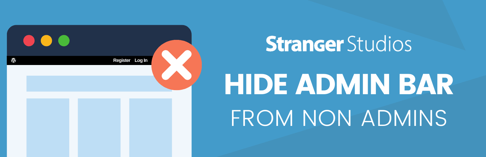

# [Hide Admin Bar from Non-Admins](https://wordpress.org/plugins/hide-admin-bar-from-non-admins/) #
[comment]: # (Generate badges from shields.io, only works for .org plugins to get other stats etc. We'd have to create our own endpoints for Premium plugins)

 

### Welcome to the Hide Admin Bar from Non-Admins GitHub Repository
This plugin hides the WordPress Toolbar (admin bar) for all visitors and users without the 'administrator' role. It's a very simple plugin with no settings to configure.

* Use this plugin for sites with only one admin who needs access to the dashboard and the admin bar.
* This plugin is super lightweight, with just a few lines of code.
* If you need to show the toolbar for other user roles, use the filter `habfna_show_admin_bar_roles`.

This plugin is a tweak of the code by Yoast to hide the admin bar for non-admins only.

For more information please visit [wordpress.org/plugins/hide-admin-bar-from-non-admins/](https://wordpress.org/plugins/hide-admin-bar-from-non-admins/)

## Installation ##
For detailed installation steps, visit the our [documentation](https://www.paidmembershipspro.com/add-ons/hide-admin-bar-from-non-admins/) page.

1. Download the current development ZIP file directly: `https://github.com/strangerstudios/hide-admin-bar-from-non-admins/archive/dev.zip`

**Please ensure that once installing this version of the plugin to remove `-dev` from the plugin's folder name.**

## Bugs ##
If you find an issue/bug, let us know by [creating a detailed GitHub issue](https://github.com/strangerstudios/hide-admin-bar-from-non-admins/issues/new).

## Support ##
This is a developer's portal for Hide Admin Bar from Non-Admins. We do not offer support on this channel. **Any support related questions should be directed to [wordpress.org/support/plugin/hide-admin-bar-from-non-admins/](https://wordpress.org/support/plugin/hide-admin-bar-from-non-admins/).**

## Contributing to Hide Admin Bar from Non-Admins ##

There are various **ways to help development** of Hide Admin Bar from Non-Admins:

1. Report [bugs/issues](https://github.com/strangerstudios/hide-admin-bar-from-non-admins/issues/new) on GitHub.
2. Work on any issues by submitting a Pull Request.

Here are some ways for **non-developers to contribute** to Hide Admin Bar from Non-Admins:

1. Leave an honest review for [Hide Admin Bar from Non-Admins](https://wordpress.org/support/plugin/hide-admin-bar-from-non-admins/reviews/#new-post).
